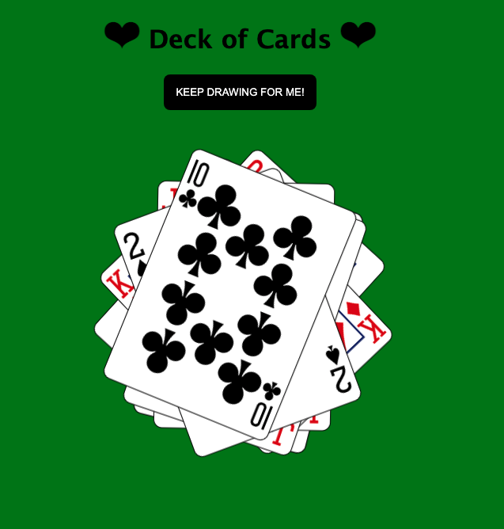

# Deck of Cards App

This project was bootstrapped with [Create React App](https://github.com/facebook/create-react-app).

App that displays a deck of cards, one card at a time. When you click on the button, the page will draw one card every second. These draws will continue until you press the button again, or until the deck has been exhausted (at which point an alert message appears on the screen with the text “Error: no cards remaining!).

 